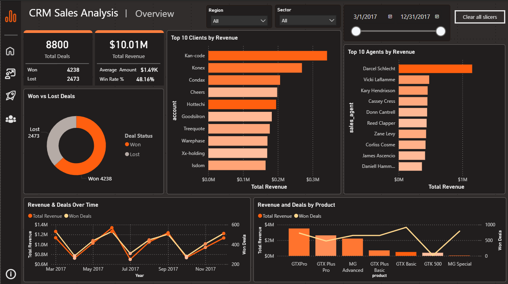

# 📈 CRM Sales Analytics – Power BI Dashboard  
📊 **End-to-End Power BI Project | Client Revenue | Deal Insights | Sales Performance**  

🌐 **[🔗 View Live Dashboard (Power BI Web)](https://app.powerbi.com/view?r=eyJrIjoiYjZkZDUzZjctMmFlZS00Y2FhLTkwMzYtNDUwM2EyMmVlY2VmIiwidCI6IjY3NDM4ODYzLThjOTItNGQ0ZC1iMjAyLTIzNmZjMjNhZDk2MCIsImMiOjl9)**

---

## 🔍 Project Overview  
This Power BI report offers a **comprehensive view of CRM sales activities**, allowing users to analyze client revenue, deal performance, sales agent outcomes, and sector distribution across regions.

The dashboard supports **dynamic filtering by client, sector, region, and date**, providing actionable insights for decision-makers and sales teams alike.

---

## 🧩 Dataset & Modeling  
🔹 Core table: `Accounts` with client, revenue, and employee data  
🔹 Supporting tables include sales deals, agents, products, regions, and deal stages  
🔹 Cleaned and transformed using **Power Query**  
🔹 Model built with **star schema** and defined relationships for efficient querying

---

## 📊 Power BI Pages & Features  

### 🔹 1. Overview  
✅ High-level KPIs: **Total Deals, Total Revenue, Avg Amount, Win Rate**  
✅ Visuals:  
- Top 10 Clients by Revenue  
- Top Agents by Revenue  
- Won vs Lost Pie Chart  
- Revenue & Deals Over Time  
- Product Revenue Breakdown  

  

---

### 🔹 2. Client Overview  
✅ Focused analysis of **client distribution, top accounts, and sectors**  
✅ Visuals:  
- Revenue vs Employees Scatter  
- Top 10 Clients by Revenue  
- Revenue by Client Sector  
- Map of Office Locations  
- Sector-Wise Summary Table  

  

---

### 🔹 3. Performance Insights  
✅ Deep dive into **top-performing agents, teams, and product lines**  
✅ Visuals:  
- Top Agent, Product, and Team KPIs  
- Win Rate by Region  
- Product Series Comparison (GTX vs MG)  
- Full Agent-Stage Revenue Matrix  

  

---

### 🔹 4. Sales Analytics  
✅ Breakdown of deals by **status, performance over time, and close duration**  
✅ Visuals:  
- Deals by Status (Won, Lost, Engaging, Prospecting)  
- Win/Loss Donut  
- Revenue Over Time  
- Avg Close Duration  
- Top 10 Clients by Revenue  

  

---

## 📈 Key Insights  
🔹 Client **"Kan-code"** generated highest revenue at **$341K**  
🔹 **Retail** and **Technology** sectors dominated total revenue  
🔹 Top product **GTXPro** brought in **$3.5M+ revenue**  
🔹 Win rate varied across regions, highest in the **East (51.1%)**  
🔹 Over **4,200 deals won**—about **48%** of total opportunities

---

## 🧭 How to Use This Dashboard  
1️⃣ Use slicers (Client, Sector, Region, Date) to filter the data  
2️⃣ Navigate using the left sidebar to explore different perspectives  
3️⃣ Hover on visuals to see detailed tooltips  

🌐 **[🔗 View Live Dashboard (Power BI Web)](https://app.powerbi.com/view?r=eyJrIjoiYjZkZDUzZjctMmFlZS00Y2FhLTkwMzYtNDUwM2EyMmVlY2VmIiwidCI6IjY3NDM4ODYzLThjOTItNGQ0ZC1iMjAyLTIzNmZjMjNhZDk2MCIsImMiOjl9)**

---

## 💡 Why This Project Stands Out  
✅ Real-world CRM dataset with multiple linked dimensions  
✅ Rich KPI design with **advanced DAX** for win rates & time metrics  
✅ Fully interactive **dark-themed report** with smooth navigation  
✅ Great example of **end-to-end sales funnel analysis** using Power BI  

---

## 👨‍💻 About Me  
Hi, I'm **Shareef Ali**, a dedicated **Data Analyst** passionate about transforming business problems into visual insights through **Power BI, SQL, and Python.**

📬 **Let’s connect!**  
🔗 **[GitHub Portfolio](https://github.com/shareef99997)**  
🔗 **[LinkedIn](https://www.linkedin.com/in/shareef-ali/)**  
🔗 **[Personal Website](https://www.shareefdev.com)**

📢 **If you found this helpful, please leave a ⭐ on GitHub!**
